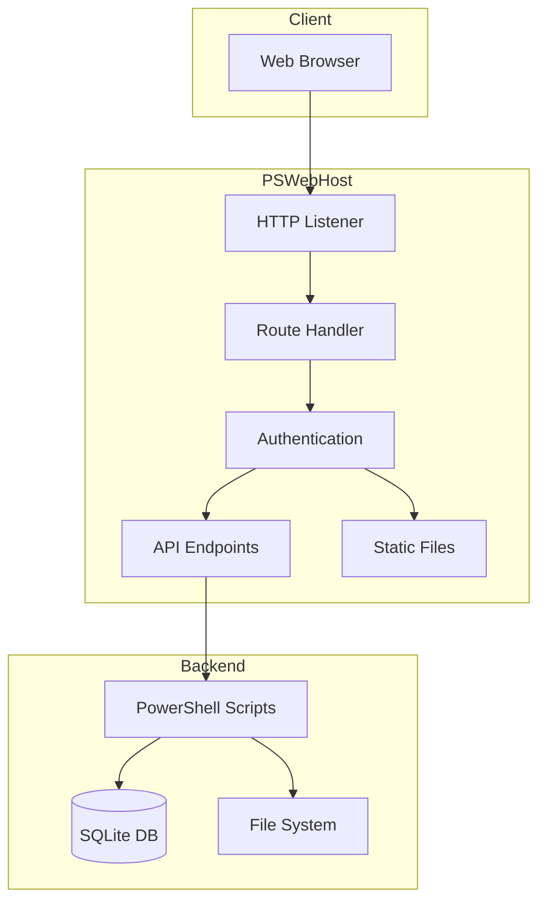
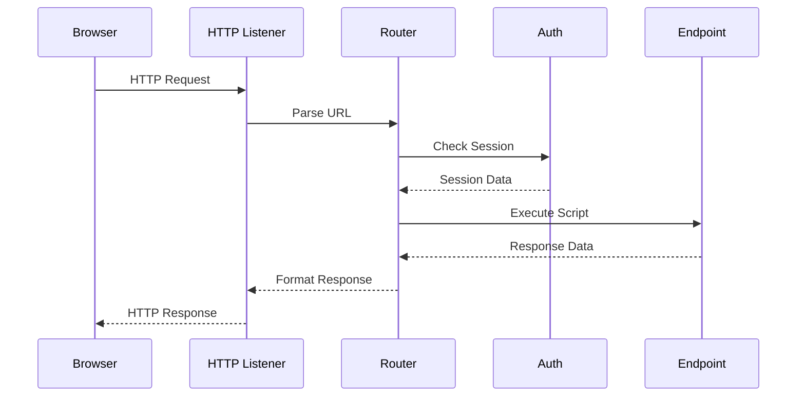
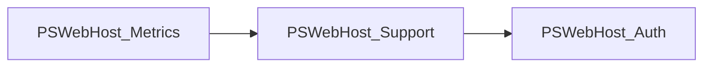
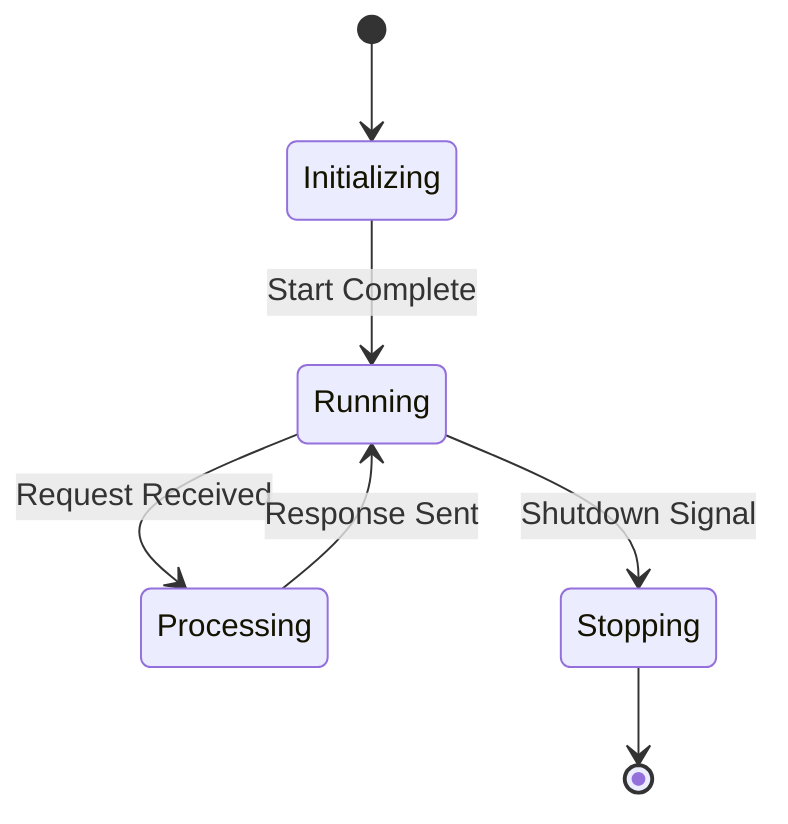

# PSWebHost Architecture

This document describes the architecture of PSWebHost.

## System Overview

PSWebHost is a PowerShell-based web server designed for system administration and monitoring tasks.

## Request Flow

When a request comes in, it follows this sequence:

## Component Types

| Component | Description | Location |
|-----------|-------------|----------|
| Routes | API endpoints | `routes/` |
| Elements | UI components | `public/elements/` |
| Modules | PowerShell modules | `modules/` |
| Static | CSS, JS, images | `public/` |

## Module Dependencies

## State Diagram

The server can be in the following states:

## Key Features

- **Hot Reload**: API endpoints and UI components can be modified without restart
- **Role-Based Access**: Security configured per-endpoint
- **Background Jobs**: Timer-based metrics collection
- **Session Management**: Cookie-based with SQLite persistence

## Getting Started

1. Clone the repository
2. Run `system/init.ps1`
3. Access `http://localhost:8080`

For more information, see the individual component help files.
