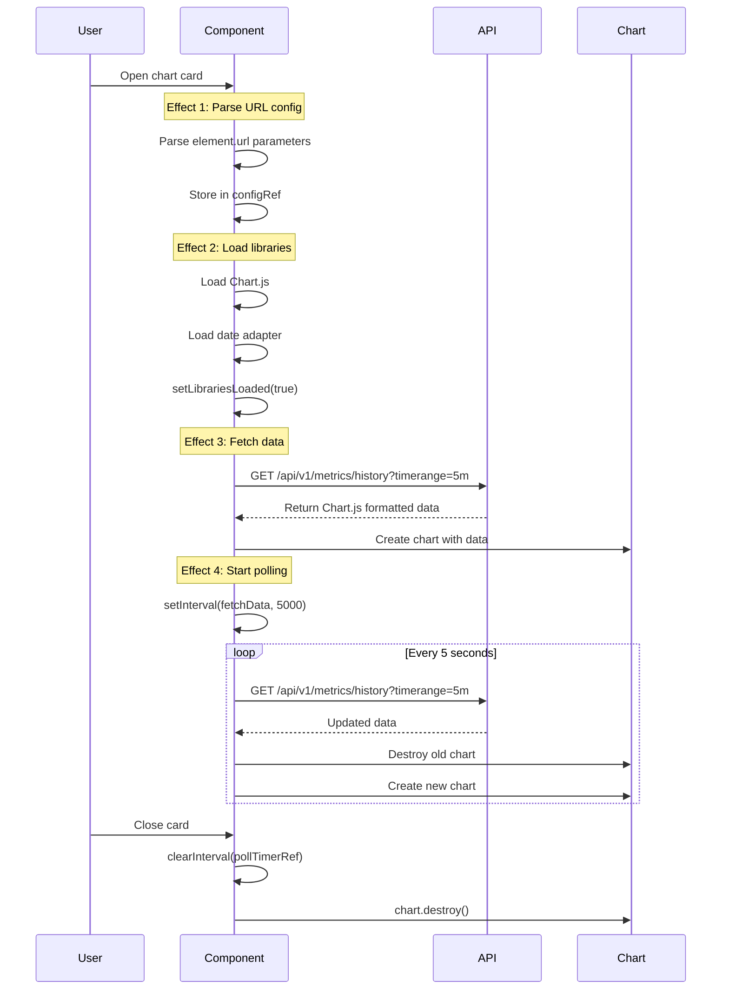

# Chart Data Access and Refresh Mechanisms

## Overview

PSWebHost uses a sophisticated multi-layer data access strategy for charts, combining historical data loading, real-time polling, and client-side caching for optimal performance.

## Architecture Layers

```mermaid
graph TB
    subgraph "Data Collection (Backend)"
        A[Metrics Collection Job]
        B[5-second Samples]
        C[1-minute Aggregates]
        D[CSV Files on Disk]
    end

    subgraph "APIs (Backend)"
        E[/api/v1/metrics]
        F[/api/v1/metrics/history]
        G[/api/v1/perfhistorylogs]
    end

    subgraph "Chart Component (Frontend)"
        H[ChartJS Component]
        I[Polling Timer]
        J[Chart.js Instance]
    end

    subgraph "Browser Storage"
        K[(IndexedDB Cache)]
    end

    A -->|Every 5s| B
    A -->|Every 1m| C
    C -->|Persist| D

    B --> E
    B --> F
    D --> G

    H -->|Initial Load| F
    H -->|Periodic Poll| E
    H -->|Cache Read/Write| K
    I -->|Trigger| H
    H -->|Render| J

    style A fill:#8b5cf6
    style E fill:#f59e0b
    style F fill:#22c55e
    style G fill:#3b82f6
    style H fill:#ef4444
```

## Data Collection (Backend)

### 1. Metrics Collection Job

**Location**: `modules/PSWebHost_Metrics/PSWebHost_Metrics.psm1`

**Process**:
```powershell
# Runs continuously in background runspace
while ($true) {
    # Collect system metrics
    $snapshot = Get-SystemMetricsSnapshot

    # Store in synchronized in-memory storage
    $Global:PSWebServer.Metrics.Samples.Add($snapshot)
    $Global:PSWebServer.Metrics.Current = $snapshot

    # Trim old samples (keep last hour)
    $cutoff = (Get-Date).AddHours(-1)
    Remove old samples before $cutoff

    # Every minute: aggregate and write to CSV
    if ((Get-Date).Second -eq 0) {
        Aggregate-Metrics
        Write-MetricsToCSV
    }

    Start-Sleep -Seconds 5
}
```

**Data Structure**:
```powershell
$Global:PSWebServer.Metrics = @{
    # Latest snapshot (updated every 5s)
    Current = @{
        Timestamp = [DateTime]
        Cpu = @{
            Total = 45.2          # Average across all cores
            Cores = @(44.1, 46.3, 45.0, 45.4)  # Per-core usage
        }
        Memory = @{
            UsedPercent = 68.5
            TotalGB = 16.0
            AvailableGB = 5.04
        }
        Disk = @{ Drives = @(...) }
        Network = @{ BytesPerSec = 1234567 }
    }

    # Raw samples (5s intervals, last 1 hour = 720 samples)
    Samples = [ArrayList]::Synchronized(@(
        # 720 samples, each like Current above
    ))

    # Aggregated (1m intervals, last 24h = 1,440 samples)
    Aggregated = [ArrayList]::Synchronized(@(
        # 1,440 aggregated samples with min/max/avg
    ))
}
```

**Retention**:
- In-memory samples: 1 hour (720 × 5-second samples)
- In-memory aggregates: 24 hours (1,440 × 1-minute aggregates)
- CSV files on disk: 30 days (configurable)

## API Endpoints

### 1. Current Metrics API

**Endpoint**: `GET /api/v1/metrics`
**Source**: In-memory `$Global:PSWebServer.Metrics.Current`
**Purpose**: Real-time current metrics for polling

**Response**:
```json
{
    "status": "success",
    "timestamp": "2026-01-06T01:30:00Z",
    "metrics": {
        "cpu": [
            { "core": 0, "value": 44.1 },
            { "core": 1, "value": 46.3 },
            { "core": 2, "value": 45.0 },
            { "core": 3, "value": 45.4 }
        ],
        "memory": {
            "usedPercent": 68.5,
            "totalGB": 16.0,
            "availableGB": 5.04
        },
        "disk": [...],
        "network": {
            "bytesPerSec": 1234567
        }
    }
}
```

**Use Case**: Charts poll this every 5 seconds to append new data points

### 2. Metrics History API

**Endpoint**: `GET /api/v1/metrics/history?metric=cpu&timerange=5m`
**Source**: In-memory `$Global:PSWebServer.Metrics.Samples`
**Purpose**: Historical data in Chart.js format for initial chart load

**Parameters**:
- `metric`: cpu, memory, disk, network
- `timerange`: 5m, 15m, 30m, 1h, 3h, 6h, 12h, 24h
- `format`: chartjs (default)

**Process**:
```powershell
# Parse time range
$minutes = Parse-TimeRange($timeRange)  # "5m" → 5 minutes
$cutoffTime = (Get-Date).AddMinutes(-$minutes)

# Filter samples
$filteredSamples = $Global:PSWebServer.Metrics.Samples |
    Where-Object { $_.Timestamp -ge $cutoffTime } |
    Sort-Object Timestamp

# Convert to Chart.js format
for each core:
    $coreData = $filteredSamples | ForEach-Object {
        @{
            x = Get-Date $_.Timestamp -Format 'o'  # ISO 8601
            y = [double]$_.Cpu.Cores[$i]
        }
    }

    Add dataset for this core
```

**Response**:
```json
{
    "status": "success",
    "metric": "cpu",
    "timeRange": "5m",
    "sampleCount": 60,
    "data": {
        "datasets": [
            {
                "label": "CPU 0",
                "data": [
                    { "x": "2026-01-06T01:25:00.000Z", "y": 44.1 },
                    { "x": "2026-01-06T01:25:05.000Z", "y": 44.5 },
                    { "x": "2026-01-06T01:25:10.000Z", "y": 43.8 }
                ],
                "borderColor": "#3b82f6",
                "fill": false
            },
            {
                "label": "CPU 1",
                "data": [...],
                "borderColor": "#ef4444"
            },
            {
                "label": "Average",
                "data": [...],
                "borderColor": "#ffffff",
                "borderWidth": 3
            }
        ]
    }
}
```

**Use Case**: Initial chart load gets baseline historical data

### 3. Performance History Logs API

**Endpoint**: `GET /api/v1/perfhistorylogs?starttime=...&endtime=...&granularity=5s`
**Source**: CSV files in `PsWebHost_Data\metrics\*.csv`
**Purpose**: Load historical data beyond in-memory retention (> 1 hour)

**Parameters**:
- `starttime`: ISO 8601 datetime (e.g., `2026-01-05T00:00:00Z`)
- `endtime`: ISO 8601 datetime
- `datasetname`: system_metrics (default)
- `granularity`: 5s, 1m, 1h, 1d, 1month, 1y
- `metrics`: cpu, memory, disk, network (comma-separated)
- `aggregation`: avg, min, max, sum, p50, p95, p99
- `format`: json, compact, csv

**Process**:
```powershell
# Read CSV files in date range
$csvFiles = Get-ChildItem "PsWebHost_Data\metrics\*.csv" |
    Where-Object {
        $fileDate = Parse date from filename
        $fileDate -ge $startTime -and $fileDate -le $endTime
    }

# Parse CSV data
$allSamples = $csvFiles | ForEach-Object {
    Import-Csv $_.FullName |
        ConvertFrom-Csv |
        Where-Object { $_.Timestamp -ge $startTime -and $_.Timestamp -le $endTime }
}

# Apply granularity (aggregate if needed)
if ($granularity -ne "5s") {
    $allSamples = Aggregate-MetricsData -Samples $allSamples -Granularity $granularity
}

# Return JSON
return $allSamples | ConvertTo-Json -Depth 10
```

**Use Case**: Loading historical data for ranges > 1 hour (e.g., 24h, 7d, 30d)

## Frontend Chart Component

### ChartJS Component Architecture

**File**: `public/elements/chartjs/component.js`

**State Management**:
```javascript
const [chartInstance, setChartInstance] = useState(null);
const [data, setData] = useState(null);
const [loading, setLoading] = useState(true);
const [error, setError] = useState(null);
const [isPaused, setIsPaused] = useState(false);
const [librariesLoaded, setLibrariesLoaded] = useState(false);

const canvasRef = useRef(null);
const pollTimerRef = useRef(null);
const configRef = useRef({});
```

### Lifecycle Flow



### Data Fetch Mechanism

**Initial Load**:
```javascript
// Effect runs once when libraries are loaded
useEffect(() => {
    if (!librariesLoaded) return;

    fetchData();  // Initial fetch

    return () => {
        clearInterval(pollTimerRef.current);
        if (chartInstance) chartInstance.destroy();
    };
}, [librariesLoaded]);
```

**Fetch Function**:
```javascript
const fetchData = async () => {
    if (!configRef.current.source || isPaused) return;

    // Build URL with parameters
    const sourceUrl = new URL(config.source, window.location.origin);
    for (const [key, value] of Object.entries(config.sourceParams)) {
        sourceUrl.searchParams.set(key, value);  // Add metric, timerange, etc.
    }

    // Fetch data
    const response = await psweb_fetchWithAuthHandling(sourceUrl.toString());
    const responseData = await response.json();

    // Update chart
    setData(responseData);
    updateChart(responseData);
};
```

**Polling Setup**:
```javascript
// Effect runs when isPaused changes
useEffect(() => {
    if (!configRef.current.source || isPaused) return;

    const delay = configRef.current.delay * 1000;  // Default 5000ms
    pollTimerRef.current = setInterval(fetchData, delay);

    return () => {
        if (pollTimerRef.current) {
            clearInterval(pollTimerRef.current);
        }
    };
}, [isPaused]);
```

### Chart Update Mechanism

**Update Flow**:
```javascript
const updateChart = (chartData) => {
    if (!canvasRef.current || typeof Chart === 'undefined') return;

    // 1. Destroy existing chart (prevents canvas reuse error)
    if (chartInstance) {
        chartInstance.destroy();
    }

    // 2. Transform data to Chart.js format
    const transformedData = transformDataForChart(chartData, config);

    // 3. Create new chart
    const chartConfig = {
        type: config.chartType,
        data: transformedData,
        options: {
            responsive: true,
            maintainAspectRatio: false,
            animation: false,  // Disable for performance
            parsing: false,     // Data already parsed
            plugins: {
                decimation: {
                    enabled: config.decimation,
                    algorithm: 'lttb',
                    samples: 500
                }
            },
            scales: {
                x: {
                    type: 'time',
                    time: {
                        displayFormats: {
                            second: 'HH:mm:ss',
                            minute: 'HH:mm',
                            hour: 'HH:mm'
                        }
                    }
                },
                y: { beginAtZero: true }
            }
        }
    };

    const newChart = new Chart(ctx, chartConfig);
    setChartInstance(newChart);
};
```

**Why Destroy and Recreate?**

Current implementation destroys and recreates the chart on each update:
- ✅ Simple: No need to manage data updates
- ✅ Clean: Prevents memory leaks
- ✅ Reliable: Avoids Chart.js state issues
- ❌ Performance: Slight overhead from recreation

**Alternative: Incremental Updates** (Future Enhancement):
```javascript
// Instead of destroying, update data
if (chartInstance) {
    // Append new data points
    chartData.datasets.forEach((dataset, i) => {
        chartInstance.data.datasets[i].data.push(...dataset.data);
    });

    // Remove old data outside time range
    const cutoff = Date.now() - parseTimeRange(timeRange);
    chartInstance.data.datasets.forEach(dataset => {
        dataset.data = dataset.data.filter(
            point => new Date(point.x).getTime() >= cutoff
        );
    });

    // Update without animation
    chartInstance.update('none');
}
```

## Refresh Mechanisms

### 1. Automatic Polling

**Configuration**:
```javascript
// From URL: /api/v1/ui/elements/chartjs?delay=5
configRef.current = {
    delay: 5,  // Seconds between polls
    // ...
};

// Set up interval
setInterval(fetchData, config.delay * 1000);
```

**Behavior**:
- Runs continuously while chart is visible
- Pauses when user clicks "Pause" button
- Stops when card is closed (component unmounts)
- Each poll fetches entire time range (not incremental)

**Performance**:
```
Poll interval: 5 seconds
Time range: 5m (60 samples)
Data size: ~5 KB per request
Bandwidth: ~1 KB/s average
```

### 2. Manual Refresh

**Trigger**: User clicks "Refresh" button

**Action**:
```javascript
const refreshNow = () => {
    fetchData();  // Immediate fetch, doesn't reset interval
};
```

**Result**: Fetches latest data immediately without waiting for next poll

### 3. Time Range Change

**Trigger**: User selects different time range (5m → 1h)

**In Server Heatmap**:
```javascript
const [timeRange, setTimeRange] = useState('5m');

// Time range change triggers chart recreation
useEffect(() => {
    // Chart component URL includes timeRange
    const chartUrl = `/api/v1/ui/elements/chartjs?timerange=${timeRange}&...`;

    // React recreates ChartJS component with new URL
    // Component fetches new data range automatically
}, [timeRange]);
```

**Result**: New chart component created with different time range parameter

### 4. Pause/Resume

**Trigger**: User clicks "Pause" or "Resume"

**Mechanism**:
```javascript
const [isPaused, setIsPaused] = useState(false);

const togglePause = () => {
    setIsPaused(!isPaused);
    if (isPaused) {
        fetchData(); // Resume and fetch immediately
    }
};

// Polling effect depends on isPaused
useEffect(() => {
    if (isPaused) return;  // Don't poll if paused

    const interval = setInterval(fetchData, delay);
    return () => clearInterval(interval);
}, [isPaused]);
```

**States**:
- ⏸️ Paused: Interval cleared, no polling
- ▶️ Resumed: Interval restarted, immediate fetch

## Data Flow Examples

### Example 1: CPU Histogram Initial Load

```
1. User opens Server Heatmap card
   ↓
2. ServerHeatmapCard component renders
   ↓
3. Creates ChartJS component with URL:
   /api/v1/ui/elements/chartjs?source=/api/v1/metrics/history
                              &metric=cpu
                              &timerange=5m
                              &delay=5
                              &decimation=true
   ↓
4. ChartJS component lifecycle:
   a. Parse URL → configRef
   b. Load Chart.js + date adapter → librariesLoaded=true
   c. Fetch data: GET /api/v1/metrics/history?metric=cpu&timerange=5m
   d. API returns 60 samples (last 5 minutes)
   e. Create Chart.js instance with data
   f. Start polling every 5 seconds
   ↓
5. Every 5 seconds:
   a. Fetch: GET /api/v1/metrics/history?metric=cpu&timerange=5m
   b. Get latest 60 samples
   c. Destroy old chart
   d. Create new chart with updated data
```

### Example 2: User Changes Time Range

```
1. User clicks "1h" button (from "5m")
   ↓
2. ServerHeatmapCard state updates: setTimeRange('1h')
   ↓
3. Chart URL changes to include timerange=1h
   ↓
4. React recreates ChartJS component
   ↓
5. New component fetches: GET /api/v1/metrics/history?metric=cpu&timerange=1h
   ↓
6. API returns 720 samples (last 1 hour)
   ↓
7. Chart.js renders with decimation (720 points → 500 display points via LTTB)
   ↓
8. Polling continues every 5s with new timerange=1h parameter
```

### Example 3: Polling Update

```
Time: 01:30:00 - Chart shows 5m (01:25:00 to 01:30:00)
   ↓
Time: 01:30:05 - Poll interval fires
   ↓
Fetch: GET /api/v1/metrics/history?metric=cpu&timerange=5m
   ↓
API filters samples: 01:25:05 to 01:30:05 (60 samples)
   ↓
API returns Chart.js format with all 60 samples
   ↓
Component destroys old chart
   ↓
Component creates new chart with fresh data
   ↓
Chart displays 01:25:05 to 01:30:05 (1 new sample, 1 old sample dropped)
```

## Performance Considerations

### 1. Polling Overhead

**Current**: Full dataset refetch every 5 seconds
```
Time range: 5m = 60 samples
Request size: ~5 KB
Frequency: Every 5s
Bandwidth: 1 KB/s average
```

**Optimization** (Future): Incremental fetch
```
Fetch only new samples since last poll
Request: GET /api/v1/metrics?sincetime=2026-01-06T01:30:00Z
Response: Only 1 new sample
Bandwidth: 0.1 KB/s (90% reduction)
```

### 2. Chart Recreation

**Current**: Destroy and recreate every poll
- Performance impact: ~20ms per recreation
- Memory: Triggers garbage collection
- Visual: Brief flicker on slow devices

**Optimization** (Future): Incremental update
```javascript
chart.data.datasets[0].data.push(newPoint);
chart.data.datasets[0].data.shift(); // Remove oldest
chart.update('none');  // No animation
```

### 3. Data Decimation

**Enabled**: Chart.js LTTB algorithm
```
Raw data: 720 points (1h @ 5s intervals)
Display: 500 points (via decimation)
Rendering: Fast, smooth
```

**Settings**:
```javascript
decimation: {
    enabled: true,
    algorithm: 'lttb',  // Preserves visual shape
    samples: 500         // Target display points
}
```

### 4. Animation Disabled

**Setting**: `animation: false`

**Impact**:
- Chart updates instantly (no transition delay)
- Reduced CPU usage during polling
- Better performance on slow devices
- No visual jitter during rapid updates

## Future Enhancements

### 1. WebSocket Streaming

Replace polling with real-time push:
```javascript
const ws = new WebSocket('ws://localhost:8080/metrics/stream');
ws.onmessage = (event) => {
    const newSample = JSON.parse(event.data);
    appendToChart(newSample);
};
```

**Benefits**:
- Sub-second latency
- No polling overhead
- Server-initiated updates
- Bandwidth efficient

### 2. IndexedDB Caching

Cache historical data locally:
```javascript
// First load: Fetch from API, store in IndexedDB
const data = await fetchHistory('1h');
await indexedDB.put('metrics', data);

// Subsequent loads: Read from cache
const cachedData = await indexedDB.get('metrics');
```

**Benefits**:
- Instant chart display
- Reduced server load
- Offline capability
- Gap-based fetching

### 3. Smart Polling

Adjust poll rate based on activity:
```javascript
// User inactive: Poll every 30s
// User active: Poll every 5s
// Chart maximized: Poll every 2s
if (isUserActive && isChartVisible) {
    interval = 5000;
} else {
    interval = 30000;
}
```

### 4. Progressive Loading

Load low-res first, fill in details:
```javascript
// Step 1: Load 1m aggregates (fast)
const lowRes = await fetchHistory('1h', '1m');
renderChart(lowRes);

// Step 2: Load 5s samples (detailed)
const highRes = await fetchHistory('1h', '5s');
renderChart(highRes);
```

## Summary

### Current Architecture

✅ **Simple**: Polling-based, full dataset refresh
✅ **Reliable**: Destroy/recreate prevents state issues
✅ **Complete**: Historical + real-time support
✅ **Performant**: Client-side decimation, no animations

### Data Access Pattern

```
Initial Load → Historical API (baseline)
    ↓
Start Polling → Current/History API (updates)
    ↓
Every 5s → Fetch full time range → Recreate chart
```

### Key Components

1. **Backend Collection**: Continuous 5s sampling
2. **History API**: Chart.js formatted historical data
3. **ChartJS Component**: Polling and rendering
4. **Chart.js**: Visualization with time scale and decimation

### Performance Metrics

- Poll interval: 5 seconds
- Data size: 5 KB per request
- Chart recreation: 20ms
- Decimation: 720 points → 500 display points
- Memory: ~50 KB per chart instance
