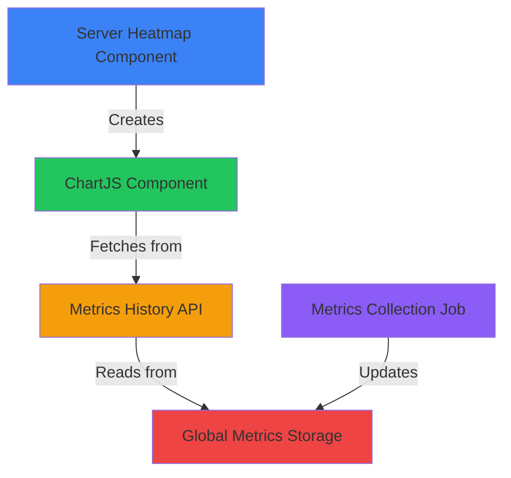

# CPU Histogram Architecture

## Overview

The CPU histogram is a real-time Chart.js line chart that displays per-core CPU usage with automatic polling, resizing, and time range selection. It uses a three-component architecture with client-side decimation.

## Component Architecture



## Data Flow

### 1. Metrics Collection (Backend)
**File**: `modules/PSWebHost_Metrics/PSWebHost_Metrics.psm1`

```powershell
# Metrics are collected every 5 seconds
$script:MetricsConfig = @{
    SampleIntervalSeconds = 5        # Raw sample interval
    AggregationIntervalMinutes = 1   # Minute averages
    RetentionHours = 24              # In-memory retention
    CsvRetentionDays = 30            # Disk persistence
}

# Storage structure
$Global:PSWebServer.Metrics = @{
    Current = @{                     # Latest snapshot
        Cpu = @{ Cores = @(45.2, 46.1, 44.8, ...) }
    }
    Samples = [ArrayList]            # Last hour (720 x 5s samples)
    Aggregated = [ArrayList]         # Last 24h (1440 x 1m averages)
}
```

**Sample Structure**:
```powershell
@{
    Timestamp = [DateTime]
    Cpu = @{
        Cores = @(45.2, 46.1, 44.8, 43.9)  # Per-core percentages
        Total = 44.8                        # Average across all cores
    }
    Memory = @{ UsedPercent = 68.5 }
    Disk = @{ Drives = @() }
    Network = @{ BytesPerSec = 1234567 }
}
```

### 2. Server Heatmap Component (Frontend Container)
**File**: `public/elements/server-heatmap/component.js`

**Purpose**: Container component that provides chart controls and embedding

**Key Features**:
- Time range selector buttons (5m, 15m, 30m, 1h, 3h, 6h, 12h, 24h)
- Granularity indicator (shows "5s samples" or "1m averages")
- Resizable chart (150-600px height via drag handle)
- Pause/Resume auto-refresh
- Chart positioned below CPU core cards

**State Management**:
```javascript
const [timeRange, setTimeRange] = useState('5m');
const [chartHeight, setChartHeight] = useState(250);
const [autoRefresh, setAutoRefresh] = useState(true);
```

**Chart Embedding**:
```javascript
React.createElement(window.cardComponents.chartjs, {
    element: {
        url: `/api/v1/ui/elements/chartjs?source=/api/v1/metrics/history&metric=cpu&timerange=${timeRange}&delay=5&charttype=line&title=CPU Usage&ylabel=Usage %&decimation=true`
    },
    onError: onError
})
```

**URL Parameters**:
- `source`: Backend API endpoint for data
- `metric`: Type of metric (cpu, memory, disk, network)
- `timerange`: Time window (5m, 1h, 24h, etc.)
- `delay`: Polling interval in seconds (default: 5)
- `charttype`: Chart.js type (line, bar, etc.)
- `decimation`: Enable client-side LTTB decimation (true/false)

### 3. ChartJS Component (Generic Charting)
**File**: `public/elements/chartjs/component.js`

**Purpose**: Reusable Chart.js wrapper with polling and configuration

**Configuration Parsing**:
```javascript
configRef.current = {
    source: '/api/v1/metrics/history',
    sourceMethod: 'GET',
    contentType: 'json',
    delay: 5,                    // Poll every 5 seconds
    chartType: 'line',
    timeRange: '5m',
    decimation: true             // Enable LTTB
};
```

**Polling Logic**:
```javascript
React.useEffect(() => {
    if (!configRef.current.source || isPaused) return;

    const delay = configRef.current.delay * 1000;
    pollTimerRef.current = setInterval(fetchData, delay);

    return () => {
        if (pollTimerRef.current) {
            clearInterval(pollTimerRef.current);
        }
    };
}, [isPaused]);
```

**Chart Configuration**:
```javascript
const chartConfig = {
    type: 'line',
    data: transformDataForChart(chartData, config),
    options: {
        responsive: true,
        maintainAspectRatio: false,
        animation: false,        // Disable for performance
        parsing: false,          // Data pre-parsed
        plugins: {
            decimation: {
                enabled: true,
                algorithm: 'lttb',  // Largest-Triangle-Three-Buckets
                samples: 500         // Target display points
            }
        },
        scales: {
            x: {
                type: 'time',       // Time-series x-axis
                time: {
                    displayFormats: {
                        second: 'HH:mm:ss',
                        minute: 'HH:mm',
                        hour: 'HH:mm'
                    }
                }
            },
            y: {
                beginAtZero: true
            }
        },
        elements: {
            point: { radius: 0 },    // No point markers
            line: { borderWidth: 2 }
        }
    }
};
```

### 4. Metrics History API (Backend)
**File**: `routes/api/v1/metrics/history.ps1`

**Purpose**: Returns metrics in Chart.js format from in-memory storage

**Request Parameters**:
- `metric`: cpu, memory, disk, network (default: cpu)
- `timerange`: 5m, 15m, 30m, 1h, 3h, 6h, 12h, 24h (default: 5m)
- `format`: chartjs (reserved for future formats)

**Time Range Parsing**:
```powershell
$minutes = switch -Regex ($timeRange) {
    '^\d+m$' { [int]($timeRange -replace 'm', '') }      # 5m → 5 minutes
    '^\d+h$' { [int]($timeRange -replace 'h', '') * 60 } # 1h → 60 minutes
    default { 5 }
}

$cutoffTime = (Get-Date).AddMinutes(-$minutes)
```

**Data Filtering**:
```powershell
# Get samples from synchronized arraylist
$samples = $Global:PSWebServer.Metrics.Samples

# Filter by time range
$filteredSamples = $samples | Where-Object {
    $_.Timestamp -ge $cutoffTime
} | Sort-Object Timestamp
```

**Chart.js Data Format** (Time Scale with {x, y}):
```powershell
# Create dataset for each CPU core
for ($i = 0; $i -lt $coreCount; $i++) {
    $coreData = $filteredSamples | ForEach-Object {
        @{
            x = $_.Timestamp.ToString('o')  # ISO 8601 timestamp
            y = if ($_.Cpu.Cores[$i] -ne $null) {
                [double]$_.Cpu.Cores[$i]
            } else { 0 }
        }
    }

    $metricsData.datasets += @{
        label = "CPU $i"
        data = $coreData
        borderColor = $colors[$i % $colors.Length]
        fill = $false
    }
}

# Add average line
$avgData = $filteredSamples | ForEach-Object {
    @{
        x = $_.Timestamp.ToString('o')
        y = [double]$_.Cpu.Total
    }
}

$metricsData.datasets += @{
    label = "Average"
    data = $avgData
    borderColor = '#ffffff'
    borderWidth = 3
}
```

**Response Structure**:
```json
{
    "status": "success",
    "metric": "cpu",
    "timeRange": "5m",
    "sampleCount": 60,
    "data": {
        "datasets": [
            {
                "label": "CPU 0",
                "data": [
                    { "x": "2026-01-05T10:00:00Z", "y": 45.2 },
                    { "x": "2026-01-05T10:00:05Z", "y": 46.1 }
                ],
                "borderColor": "#3b82f6"
            }
        ]
    }
}
```

## Time Range Logic

### Data Sources by Range

| Time Range | Data Source         | Expected Points | Actual Source              |
|------------|---------------------|-----------------|----------------------------|
| 5m         | 5s samples          | 60              | `Samples` (in-memory)      |
| 15m        | 5s samples          | 180             | `Samples` (in-memory)      |
| 30m        | 5s samples          | 360             | `Samples` (in-memory)      |
| 1h         | 5s samples          | 720             | `Samples` (in-memory)      |
| 3h         | 1m averages         | 180             | `Aggregated` (in-memory)   |
| 6h         | 1m averages         | 360             | `Aggregated` (in-memory)   |
| 12h        | 1m averages         | 720             | `Aggregated` (in-memory)   |
| 24h        | 1m averages         | 1,440           | `Aggregated` (in-memory)   |

### Current Implementation Status

**✅ Working**:
- 5-second samples are collected
- Stored in `$Global:PSWebServer.Metrics.Samples`
- API filters by time range
- Chart.js displays with decimation

**⚠️ Issues**:
1. **No aggregation separation**: API doesn't switch between `Samples` and `Aggregated` based on time range
2. **Fixed sample source**: Always reads from `Samples` regardless of range
3. **Limited retention**: Only 1 hour of 5s samples stored (720 points)
4. **No 1-minute aggregates**: The `Aggregated` arraylist exists but may not be populated

### Expected vs Actual Behavior

**Current Behavior**:
```powershell
# ALL time ranges use this:
$samples = $Global:PSWebServer.Metrics.Samples  # Only has 1h of 5s data

# For 24h request:
$cutoffTime = (Get-Date).AddMinutes(-1440)  # 24 hours ago
$filteredSamples = $samples | Where-Object { $_.Timestamp -ge $cutoffTime }
# Result: Returns 0 samples because Samples only has 1h of data
```

**Expected Behavior**:
```powershell
# For 1h or less → Use 5s samples
if ($minutes -le 60) {
    $samples = $Global:PSWebServer.Metrics.Samples
}
# For >1h → Use 1m aggregates
else {
    $samples = $Global:PSWebServer.Metrics.Aggregated
}
```

## Client-Side Decimation (LTTB)

### Why Client-Side?

**Traditional Approach (Server-Side)**:
```
User changes range → Server aggregates → Send subset → Render
User zooms out     → Server re-aggregates → Send more → Re-render
User zooms in      → Server queries → Send → Re-render (cache miss)
```

**Client-Side Approach**:
```
Initial load    → Fetch raw data → Cache in browser → Decimate for display
User zooms out  → Fetch gaps → Merge cache → Decimate
User zooms in   → Use cache → Decimate (no backend call)
```

### LTTB Algorithm

**Largest-Triangle-Three-Buckets** preserves visual shape:

```
Step 1: Divide data into buckets
[●●●●●] [●●●●●] [●●●●●] [●●●●●]  (1000 points → 4 buckets)

Step 2: For each bucket, find point that creates largest triangle
   A
  / \
 /   \
●     ●
↑ Selected point (max triangle area with neighbors)

Step 3: Result preserves peaks and valleys
●       ●       ●       ●  (250 points, same visual shape)
```

**Chart.js Configuration**:
```javascript
decimation: {
    enabled: true,
    algorithm: 'lttb',
    samples: 500  // Target display points
}
```

**Performance**:
- 60 points (5m) → No decimation needed
- 720 points (1h) → Decimates to 500 → Smooth rendering
- 1,440 points (24h) → Decimates to 500 → Fast updates

## Problems & Solutions

### Problem 1: Chart Not Loading
**Symptom**: "Loading chart component..." message persists

**Possible Causes**:
1. ChartJS component script fails to load
2. Chart.js library (chart.min.js) not loaded
3. Component registration failed

**Debug**:
```javascript
// Check if component registered
console.log(window.cardComponents);
console.log(window.cardComponents.chartjs);

// Check if Chart.js loaded
console.log(typeof Chart);  // Should be 'function'
```

**Solution**:
- Removed `type='text/babel'` from script tag (was causing parse error)
- Added onload/onerror handlers for debugging

### Problem 2: Empty Chart
**Symptom**: Chart loads but shows no data

**Possible Causes**:
1. Metrics collection not running
2. Time range exceeds available data
3. API returns empty response
4. Data format mismatch

**Debug**:
```powershell
# Check metrics collection
$Global:PSWebServer.Metrics.Samples.Count
$Global:PSWebServer.Metrics.Samples | Select-Object -First 1

# Check latest sample timestamp
$Global:PSWebServer.Metrics.Samples |
    Sort-Object Timestamp -Descending |
    Select-Object -First 1 -ExpandProperty Timestamp

# Check time range
$cutoffTime = (Get-Date).AddMinutes(-5)
$Global:PSWebServer.Metrics.Samples |
    Where-Object { $_.Timestamp -ge $cutoffTime } |
    Measure-Object
```

**Solution**:
- Verify metrics job is running
- Check retention settings match time ranges
- Ensure data format matches Chart.js expectations

### Problem 3: Time Range Mismatch
**Symptom**: Selecting 24h shows no data

**Root Cause**: API always uses `Samples` which only retains 1 hour

**Solution** (Not Yet Implemented):
```powershell
# Switch data source based on time range
if ($minutes -le 60) {
    $samples = $Global:PSWebServer.Metrics.Samples
} else {
    $samples = $Global:PSWebServer.Metrics.Aggregated
}
```

### Problem 4: Performance Degradation
**Symptom**: Chart lags or jitters with large datasets

**Causes**:
- Animations enabled
- Too many points rendered
- Point markers enabled

**Solution** (Already Implemented):
```javascript
animation: false,       // Disable animations
parsing: false,         // Data pre-parsed
elements: {
    point: { radius: 0 }  // No point markers
},
plugins: {
    decimation: {
        enabled: true,
        samples: 500      // Limit display points
    }
}
```

## Configuration Summary

### Backend (Metrics Module)
```powershell
# modules/PSWebHost_Metrics/PSWebHost_Metrics.psm1
$script:MetricsConfig = @{
    SampleIntervalSeconds = 5        # How often to collect
    AggregationIntervalMinutes = 1   # Minute aggregation
    RetentionHours = 24              # In-memory retention
}
```

### API (History Endpoint)
```powershell
# routes/api/v1/metrics/history.ps1
# Query params: metric, timerange
# Returns: Chart.js {x, y} format
```

### ChartJS Component
```javascript
// public/elements/chartjs/component.js
{
    source: '/api/v1/metrics/history',
    delay: 5,              // Poll interval
    decimation: true,      // Enable LTTB
    timeRange: '5m'       // Requested range
}
```

### Chart.js Configuration
```javascript
{
    type: 'line',
    options: {
        animation: false,
        scales: { x: { type: 'time' } },
        plugins: {
            decimation: {
                algorithm: 'lttb',
                samples: 500
            }
        }
    }
}
```

## Next Steps

### Immediate Fixes Needed

1. **Fix Time Range Data Source**:
```powershell
# In routes/api/v1/metrics/history.ps1
if ($minutes -le 60) {
    $samples = $Global:PSWebServer.Metrics.Samples
} else {
    $samples = $Global:PSWebServer.Metrics.Aggregated
}
```

2. **Verify Aggregation Job**:
- Ensure 1-minute aggregates are being written to `Aggregated`
- Check aggregation logic in metrics module

3. **Add Data Availability Check**:
```powershell
$availableRange = if ($samples.Count -gt 0) {
    ($samples[-1].Timestamp - $samples[0].Timestamp).TotalMinutes
} else { 0 }

if ($minutes -gt $availableRange) {
    # Warn or adjust time range
}
```

### Future Enhancements

1. **IndexedDB Caching**: Store fetched data in browser for offline/fast access
2. **Gap Detection**: Only fetch missing time periods
3. **Progressive Loading**: Load low-res first, fill in details
4. **CSV Fallback**: For ranges >24h, read from CSV files
5. **Zoom Controls**: Let user zoom/pan without changing time range
