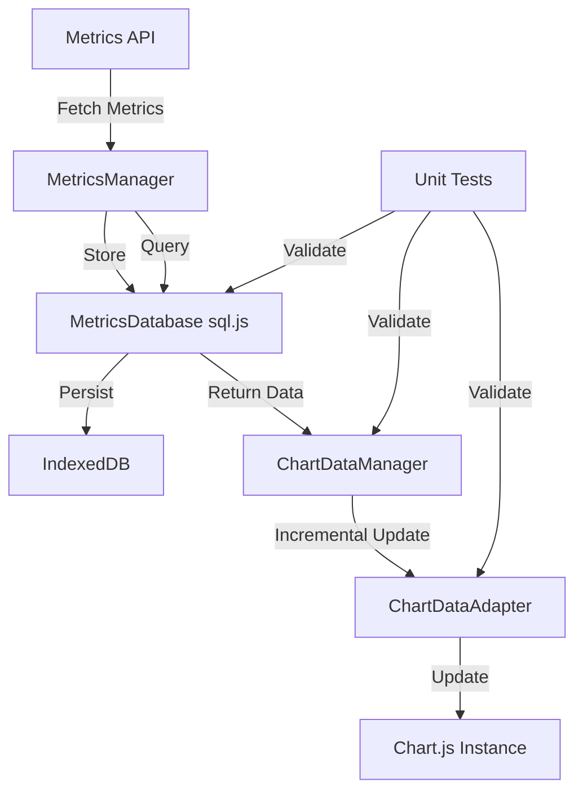

# sql.js Integration Architecture

## Overview

PSWebHost now includes a comprehensive sql.js integration for client-side metrics storage and chart management. This architecture enables persistent, queryable metrics data entirely in the browser with zero server-side database dependencies for metrics.

## Architecture Diagram



## Key Components

### 1. MetricsDatabase (`public/lib/metrics-database.js`)

**Purpose**: Wrapper around sql.js providing a structured schema for metrics storage.

**Features**:
- **Schema**: Separate tables for CPU, Memory, Disk, and Network metrics
- **Auto-Persistence**: Saves to IndexedDB every 30 seconds
- **Data Retention**: Automatic cleanup of old data (configurable, default 24 hours)
- **Indexes**: Optimized for timestamp-based queries
- **CRUD Operations**: Insert, query, update, delete for all metric types

**Usage**:
```javascript
// Initialize
const db = new MetricsDatabase({
    dbName: 'PSWebHostMetrics',
    autoSaveInterval: 30000,
    retentionHours: 24,
    maxRecords: 100000
});
await db.initialize();

// Insert metrics
db.insertMetrics({
    timestamp: new Date().toISOString(),
    hostname: 'webserver-01',
    cpu: { total: 45.5, cores: [40, 42, 48, 50] },
    memory: { totalGB: 16, usedGB: 8, usedPercent: 50 }
});

// Query metrics
const cpuData = db.queryCPUMetrics(startTime, endTime);
const memoryData = db.queryMemoryMetrics(startTime, endTime);

// Get statistics
const stats = db.getStats();
```

**Schema**:
- `metrics` - Main metrics table with basic info
- `cpu_metrics` - CPU usage data (total + per-core)
- `memory_metrics` - Memory usage data
- `disk_metrics` - Disk usage by drive
- `network_metrics` - Network throughput

### 2. ChartDataAdapter (`public/lib/chart-data-adapter.js`)

**Purpose**: Manages incremental chart updates without destroying/recreating charts.

**Features**:
- **Incremental Updates**: `appendData()` adds new points without chart recreation
- **Data Replacement**: `replaceData()` for time range changes
- **Automatic Trimming**: Removes old data based on time window or max points
- **No Animations**: Update mode set to 'none' for performance

**Usage**:
```javascript
// Create adapter for existing chart
const adapter = new ChartDataAdapter(chartInstance, {
    maxDataPoints: 1000,
    updateMode: 'none',
    timeWindow: 3600000 // 1 hour in ms
});

// Append new data (incremental)
adapter.appendData({
    datasets: [{
        data: [{ x: timestamp, y: value }]
    }]
});

// Replace all data (time range change)
adapter.replaceData({
    datasets: [{
        data: [/* new data points */]
    }]
});

// Trim old data
adapter.trimOldData();
```

**Key Methods**:
- `appendData(newData)` - Add points incrementally
- `replaceData(newData)` - Full data replacement
- `trimOldData()` - Remove old points
- `setTimeWindow(ms)` - Update time window
- `getStats()` - Get adapter statistics

### 3. ChartDataManager (`public/lib/chart-data-adapter.js`)

**Purpose**: Connects MetricsDatabase to Chart.js instances with automatic updates.

**Features**:
- **Chart Registration**: Register charts for auto-updates
- **Automatic Polling**: Query sql.js and push to charts
- **Format Conversion**: Converts sql.js results to Chart.js format
- **Multiple Chart Support**: Manage many charts simultaneously

**Usage**:
```javascript
const manager = new ChartDataManager(metricsDatabase);

// Register chart with auto-updates
const adapter = manager.registerChart('cpu-chart', chartInstance, {
    metricType: 'cpu',
    autoUpdate: true,
    updateInterval: 5000
});

// Query historical data
await manager.loadHistoricalData('cpu-chart', startTime, endTime);

// Get chart statistics
const stats = manager.getChartStats('cpu-chart');
```

**Metric Types**:
- `cpu` - CPU usage (multi-line with per-core data)
- `memory` - Memory usage percentage
- `disk` - Disk usage by drive
- `network` - Network throughput

### 4. MetricsManager Integration (`public/lib/metrics-manager.js`)

**Purpose**: Unified metrics management with sql.js storage.

**Features**:
- **Automatic Storage**: All fetched metrics stored in sql.js
- **Historical Loading**: Load from perfhistorylogs API
- **Real-time Polling**: Poll /metrics endpoint
- **Dual Storage**: IndexedDB cache + sql.js database

**Usage**:
```javascript
const manager = new MetricsManager({
    sql: true,  // Enable sql.js storage
    cache: true // Enable IndexedDB cache
});

// Load historical data (auto-stored in sql.js)
await manager.loadHistorical({
    datasetname: 'system_metrics',
    starttime: startTime,
    endtime: endTime,
    metrics: ['cpu', 'memory']
});

// Start polling (auto-stored in sql.js)
manager.startPolling({
    datasetname: 'current_metrics',
    interval: 5000,
    metrics: ['cpu', 'memory'],
    onUpdate: (data) => {
        console.log('New metrics:', data);
    }
});

// Query from sql.js
const cpuData = await manager.queryFromSql('cpu', startTime, endTime);

// Get database stats
const dbStats = manager.getDbStats();
```

## Data Flow

### Historical Data Loading

```
1. User loads chart component
2. Component calls manager.loadHistorical()
3. Manager fetches from /api/v1/perfhistorylogs
4. Data stored in:
   - Memory (datasets Map)
   - sql.js (MetricsDatabase)
   - IndexedDB (cache)
5. Chart created with ChartDataAdapter
6. Adapter manages incremental updates
```

### Real-time Updates

```
1. Manager starts polling /api/v1/metrics
2. Every N seconds:
   a. Fetch new metrics
   b. Store in sql.js
   c. Trigger onUpdate callback
3. Chart uses adapter.appendData()
4. Old data trimmed automatically
5. No chart destroy/recreate
```

## Performance Optimizations

### 1. Incremental Updates
- Charts never destroyed/recreated
- Only new data points added
- Automatic trimming prevents memory bloat

### 2. Update Mode 'none'
- No animations on data updates
- Instant rendering
- Smooth experience with large datasets

### 3. Auto-Persistence
- sql.js saves to IndexedDB every 30s
- Only dirty data saved
- Survives page refreshes

### 4. Indexed Queries
- All tables have timestamp indexes
- Fast time-range queries
- Optimized for recent data

### 5. Data Retention
- Automatic cleanup of old data
- Configurable retention period
- Maximum record limits

## Unit Testing

The architecture includes a comprehensive unit testing framework accessible to users with the debug role.

### Test Framework (`public/lib/unit-test-framework.js`)

**Features**:
- `describe()` / `it()` syntax
- Async test support
- Comprehensive assertions
- HTML/Markdown formatters

**Usage**:
```javascript
const framework = new TestFramework();

framework.describe('MetricsDatabase Tests', function() {
    framework.it('should insert CPU metrics', async function(assert) {
        const db = new MetricsDatabase();
        await db.initialize();

        db.insertMetrics({
            timestamp: new Date().toISOString(),
            cpu: { total: 50, cores: [45, 55] }
        });

        const results = db.queryCPUMetrics(startTime, endTime);
        assert.assertGreaterThan(results.length, 0);

        db.close();
    });
});

// Run all tests
await framework.runAll();
```

### Test Suites (`public/lib/test-suites.js`)

Pre-built test suites covering:
- MetricsDatabase CRUD operations
- ChartDataAdapter incremental updates
- MetricsManager integration
- Data retention policies
- Format conversions

### Unit Test Runner UI

Access via **Admin Tools > Unit Test Runner** (debug role required).

**Features**:
- Run all tests or specific suites
- Summary and detailed views
- Pass/fail statistics
- Error messages and stack traces
- Duration tracking

## Browser Storage

### IndexedDB Structure

**Database**: `PSWebHostMetricsDB`

**Tables**:
1. **metrics** - Main metrics metadata
2. **cpu_metrics** - CPU data with per-core breakdown
3. **memory_metrics** - Memory usage data
4. **disk_metrics** - Disk usage by drive
5. **network_metrics** - Network throughput

**Auto-Save**: Every 30 seconds (configurable)

**Persistence**: Survives page refreshes, browser restarts

### Storage Limits

- **Default Retention**: 24 hours
- **Max Records**: 100,000 (configurable)
- **Auto-Cleanup**: Runs on every insert
- **Manual Cleanup**: `db.cleanOldData()`

### Console Access

Query the database from browser console:

```javascript
// Get MetricsManager instance
const manager = window.metricsManager;

// Get database stats
manager.getDbStats();

// Query metrics
await manager.queryFromSql('cpu', startTime, endTime);

// Export database
const jsonExport = await manager.exportDb();
console.log(jsonExport);
```

## Migration Guide

### For Existing Charts

**Before** (destroy/recreate pattern):
```javascript
if (chartInstance) {
    chartInstance.destroy();
}
const newChart = new Chart(ctx, chartConfig);
```

**After** (incremental updates):
```javascript
if (!chartAdapter) {
    const chart = new Chart(ctx, chartConfig);
    chartAdapter = new ChartDataAdapter(chart, {
        updateMode: 'none',
        maxDataPoints: 1000
    });
} else {
    chartAdapter.replaceData(newChartData);
}
```

### For New Components

1. Load Chart.js + date adapter + ChartDataAdapter
2. Create MetricsManager with sql enabled
3. Register chart with ChartDataManager
4. Use adapter for all updates

Example:
```javascript
// Load libraries
const manager = new MetricsManager({ sql: true });
await manager.initSqlDatabase();

// Create chart
const chartInstance = new Chart(ctx, config);

// Create data manager
const dataManager = new ChartDataManager(manager.metricsDB);

// Register chart with auto-updates
const adapter = dataManager.registerChart('my-chart', chartInstance, {
    metricType: 'cpu',
    autoUpdate: true,
    updateInterval: 5000
});
```

## Security Considerations

### Data Sensitivity

- sql.js is for **non-sensitive data only**
- All data stored in browser (client-side)
- No encryption at rest
- Accessible via browser DevTools

### Appropriate Use Cases

✅ **Good for**:
- System metrics (CPU, memory, disk, network)
- Performance data
- Real-time monitoring data
- Temporary data visualization

❌ **Not suitable for**:
- User credentials
- API keys/tokens
- Personal information
- Financial data
- Any sensitive business data

### Unit Test Access

- Restricted to **debug role** users only
- Configured in `get.security.json`
- Menu item only visible to authorized users

## Troubleshooting

### Chart Not Updating

1. Check browser console for errors
2. Verify ChartDataAdapter loaded: `typeof window.ChartDataAdapter`
3. Verify adapter created: `chartAdapterRef.current`
4. Check adapter stats: `adapter.getStats()`

### Database Not Persisting

1. Check IndexedDB is enabled in browser
2. Verify auto-save interval: `db.config.autoSaveInterval`
3. Check for quota errors in console
4. Manually save: `await db.saveToIndexedDB()`

### Tests Failing

1. Check test suites loaded: `typeof window.loadTestSuites`
2. Verify test framework: `typeof window.TestFramework`
3. Run tests individually from console
4. Check browser compatibility (modern browsers only)

### Performance Issues

1. Reduce `maxDataPoints` in ChartDataAdapter
2. Increase `autoSaveInterval` in MetricsDatabase
3. Reduce `retentionHours` for less data
4. Enable `decimation` in Chart.js config

## File Reference

### Core Libraries
- `/public/lib/sql-wasm.js` - sql.js WebAssembly
- `/public/lib/sql-wasm.wasm` - SQLite compiled to WASM
- `/public/lib/metrics-database.js` - MetricsDatabase wrapper
- `/public/lib/chart-data-adapter.js` - ChartDataAdapter + ChartDataManager
- `/public/lib/metrics-manager.js` - MetricsManager (updated)

### UI Components
- `/public/elements/chartjs/component.js` - Generic Chart.js component (updated)
- `/public/elements/memory-histogram/component.js` - Memory histogram (updated)
- `/public/elements/unit-test-runner/component.js` - Unit test runner UI

### Testing
- `/public/lib/unit-test-framework.js` - Test framework
- `/public/lib/test-suites.js` - Test suites

### API Endpoints
- `/routes/api/v1/ui/elements/unit-test-runner/get.ps1` - Test runner endpoint
- `/routes/api/v1/ui/elements/unit-test-runner/get.security.json` - Security config

### Documentation
- `/public/help/sql-js-architecture.md` - This file
- `/public/help/in-browser-sql.md` - Framework comparison
- `/public/help/in-browser-sql-security-analysis.md` - Security analysis

## Future Enhancements

### Planned Features
- [ ] Chart data export (CSV, JSON)
- [ ] Custom query builder UI
- [ ] Aggregation functions (AVG, MIN, MAX)
- [ ] Data compression for old samples
- [ ] Multi-host metrics correlation
- [ ] Alert thresholds and notifications

### Possible Additions
- [ ] WebWorker for background processing
- [ ] Shared memory between tabs
- [ ] Cloud backup/sync (optional)
- [ ] Custom metric types
- [ ] Grafana-style dashboards

## References

- [sql.js GitHub](https://github.com/sql-js/sql.js/)
- [SQLite Documentation](https://www.sqlite.org/docs.html)
- [Chart.js Documentation](https://www.chartjs.org/docs/)
- [IndexedDB API](https://developer.mozilla.org/en-US/docs/Web/API/IndexedDB_API)

---

**Last Updated**: 2026-01-06
**Author**: Claude Sonnet 4.5
**Version**: 1.0
